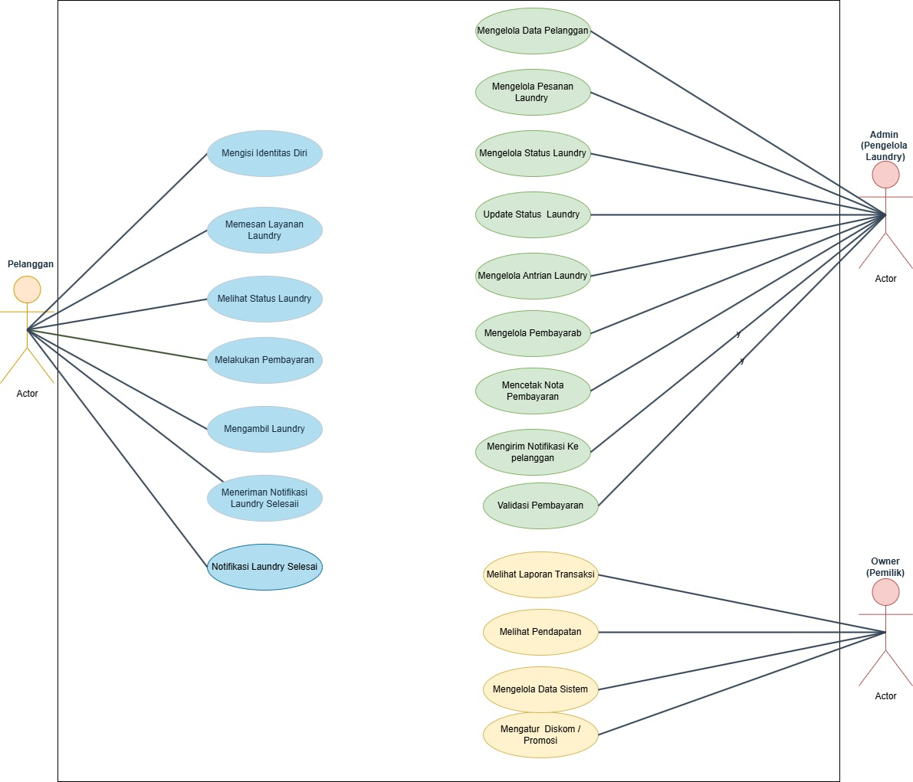

# Tugas Wawancara & Analisis Masalah Dari Perusahaan/Organisasi

### Dosen Pengampu : Adi Wahyu Pribadi, S.Si., M.Kom

#### KELOMPOK 10:
* Delsyad Iza-4524210025
* Fatimah-4524210039
* Farhan Ridwan Badhawi-4524210037
* Alfin Romi Setiawan-4524210009
* Anggun Setiawati Dewi-4523210019
 
#### Topik: Sistem Informasi Laundry
#### Cari Informasi: 
  - Sasaran Topik Dimana: Laundry Cahaya - Ibu Fira (Owner)
  - Literasi Bacaan: 
    
  - Pertanyaan: 
    1. Ibu disini posisi nya sebagai apa? 
    2. Sehari biasanya ada berapa customer dan staff yang menangani ada berapa?
    3. Kendala yang biasa dialami di laundry? 
    4. Kira - kira sistem pembayaran di sini bisa menggunakan qris apa hanya cash?
    5. Bagaimana caranya pihak laudry memberitahu kepada customer bahwa pakaian nya sudah siap di ambil?
       
  - Alur bisnisnya dari laundry:
    #### Alur Bisnis dalam Sistem Informasi Laundry
      #### Alur Bisnis dalam Sistem Informasi Laundry
    Kegiatan bisnis Sistem Informasi Laundry dibuat untuk membuat proses transaksi laundry lebih sistematis dan efektif,         serta mengurangi miskomunikasi antara pemesan dengan pihak laundry.

1. Pemesan Melakukan Order
   
   Transaksi dimulai dengan adanya pemesan langsung melakukan order di tempat laundry atau memesan dengan cara berkomunikasi    secara online menggunakan media sosial seperti WhatsApp. Di sini, pemesan memberikan barang yang ingin dilaundry.

   Pelanggan juga bisa memilih layanan yang disediakan seperti:
   * Layanan cuci
   * Layanan cuci+setrika
   * Layanan cuci express
   * Layanan cuci satuan seperti selimut, boneka, sepatu, dll.

   Pada saat ini, terkadang timbul miskomunikasi apabila pemesan tidak menjelaskan kondisi istimewa pakaian, seperti bahan      pakaian mudah luntur atau lain-lain.

2. Input Identitas dan Data Pesanan
   
   Setelah pemesan menyerahkan cucian, admin atau pegawai laundry akan mencatat identitas pemesan seperti:

   * Nama pemesan
   * Nomor telepon
   * Alamat (jika perlu)
   * Waktu penyerahan laundy

   Data pesanan yang dicatat oleh pihak laundry juga termasuk:

   * Berat cucian (kg)/jumlah cucian
   * Jenis layanan yang dipesan
   * Lama estimasi waktu pengiriman
   * Catatan (misalnya pakaian mudah luntur)

   Proses input data di Laundry Cahaya hingga saat ini masih menggunakan pencatatan manual dengan menggunakan buku catatan      atau nota kertas.

3. Harga Laundry
   
   Untuk mendapatkan total harga laundry berdasarkan berbagai faktor, di antaranya:

   * Berat laundry dalam satuan kilogram
   * Harga jasa secara umum
   * Biaya untuk layanan jasa laundry ekspres
   * Biaya lainnya jika ada benda spesial yang mau dicuci

   Perhitungan harga laundry contoh sbb:

   * Jasa cuci laundry biasa Rp7.000/kg
   * Jasa cuci laundry ekspres Rp12.000/kg
   * Jasa cuci sepatu Rp25.000/sepasang

   Dengan cara manual, perhitungan tersebut bisa saja tidak tepat.

4. Pembayaran
   
   Dengan mengetahui total biaya, pelanggan membayar tagihan tersebut dengan berbagai cara misalnya dengan:

   * Kas (tunai)
   * Bank transfer
   * QRIS (jika ada)

   Pelanggan boleh melakukan pembayaran di awal sebelum mencuci, maupun saat pengambilan barang. Setelah melakukan              pembayaran, admin mengonfirmasi bahwa transaksi telah selesai dan menerbitkan kwitansi.

5. Pesanan Memasuki Daftar Antrian Pekerjaan Laundry
   
   Setelah semua proses transaksi selesai, cucian masuk daftar antrian.
   Daftar antrian tersebut dibedakan berdasarkan:

   * Daftar antrian pesanan laundry regular
   * Daftar antrian pesanan laundry prior

6. Proses Pengerjaan Laundry
   
   Dalam proses ini, pihak laundry melakukan pengerjaan pakaian konsumen berdasarkan antrian yang ada.
   Proses pengerjaannya meliputi:

   a. Sorting / Pemilahan pakaian
   
      Pakaian dipecahkan berdasarkan warnanya, jenis material, atau tingkat kotoran yang ada.

   b. Pencucian
   
      Pakaian dicuci secara otomatis atau manual menggunakan mesin cuci.

   c. Pengeringan
   
      Pakaian di keringkan dengan mesin pengering atau langsung dijemur.

   d. Penyetrikaan
   
      Pakaian dilipat agar tampak rapi.

   e. Packing
   
      Pakaian dibungkus dalam plastik.

   Permasalahan yang sering muncul pada proses ini meliputi: pertukaran baju, rusaknya baju, serta baju mudah luntur namun      tidak diberitahu pelanggan.

7. Update Status Laundry
   
   Admin dapat melakukan update pada status dari pemesanan tersebut seperti:

   * Menunggu pengolahan
   * Sedang dicuci
   * Sedang setrika
   * Selesai

   Fitur ini berguna untuk membantu konsumen monitoring pesanan.

8. Pengiriman Notifikasi ke Pelanggan
   
   Apabila cucian telah selesai, sistem atau admin dapat mengirim notifikasi pesan kepada konsumen melalui:

   * WhatsApp
   * SMS
   * Notifikasi aplikasi

   Notifikasi ini mengandung pesan bahwa baju telah selesai dicuci dan siap diambil. Tujuannya adalah untuk mencegah            permasalahan penumpukan baju laundry.

9. Pengambilan Baju oleh Pelanggan
    
   Konsumen mengambil baju yang telah dicuci berdasarkan notifikasi tadi.  Pelanggan menunjukkan bukti pembelian agar admin     dapat melakukan pengecekan data pesanan. Jika sebelumnya pembayaran belum dilakukan, pelanggan wajib membayar lunas saat     pengambilan. Beberapa permasalahan yang sering muncul

10. Simpan Data Transaksi dan Buat Laporan
    
    Setelah terjadi transaksi, data transaksi tersebut akan disimpan di sistem.
    Beberapa contoh laporan yang dapat dibuat dengan data tersebut adalah:

    * Laporan transaksi per hari
    * Laporan transaksi per minggu
    * Laporan transaksi per bulan
    * Laporan pelanggan aktif
    * Laporan pemasukan

11. Pemantauan Oleh Owner
    
    Owner dapat memantau semua kegiatan bisnis melalui sistem, yaitu:

    * Memeriksa total pemasukan
    * Melihat total transaksi
    * Menjalankan promo
    * Menjalankan diskon
    * Membantu mengontrol karyawan/admin

  - Dokumentasi Wawancara
    https://youtu.be/4HeoocR1znk?si=NDgBW-qX23UdZzRE

#### Aktor dalam Sistem
  👤 Pelanggan (Customer)

    1. Mengisi Identitas diri
    2. Melakukan pemesanan dan memilih jenis layanan Laundry
    3. Memantau status Laundry
    4. Melakukan pembayaran melalui payment cash, payment gateaway atau via transfer
    5. Menaruh dan mengambil cucian yang di Laundry
    6. Menerima Notifikasi Laundry Selesai
   
  🧑‍💼 Admin (Pengelola Aplikasi)

    1. Mengelola Data Pelanggan
    2. Mengelola data Pesanan Laundry 
    3. Mengelola Status Laundry
    4. Mengelola antrian Laundry
    5. Mengelola Pembayaran 
    6. Mencetak nota dan memvalidasi pembayaran
    7. Mengirim notifikasi ke Pelanggan
   
  👑 Pemilik (Owner)

    1. Melihat total pendapatan harian, mingguan, atau bulanan.
    2. Memantau sisa bahan baku
    3. Mengatur hak akses aplikasi
    4. Mengatur Dsikon / Promosi

   

#### PROBLEM DARI HASIL WAWANCARA:
* Baju yang sudah selesai di laundry tidak diambil segera oleh Pemiliknya yang membuat tempat Laundry penuh;
* Pemilik baju sering mengira bajunya tertinggal di laundry padahal tidak;
* Baju yang tidak diberitahu kalo bahannya gampang luntur;
* Naruh baju ditempat laundry tapi tidak diberitahu kepada pihak laundry.
* Pencatatan pesanan masih manual (buku/nota kertas)
* Tidak ada data pelanggan dan laporan transaksi
* Banyaknya miskom antara pelanggan dan pihak laudry
* Ketergantungan WhatsApp untuk kepentingan operasional, seperti:
  - Informasi laundry sudah selesai
  - Pemesanan laundry
  - Dsb

  

 
